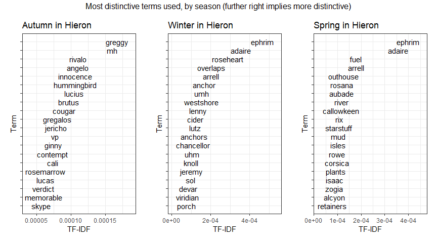

Friends at the Table Transcript Analysis
================
Nathaniel Olin
Sun May 26 15:55:06 2019

<!-- ```{r} -->
<!-- dat %>% -->
<!--   count(speaker) %>% -->
<!--   arrange(n) %>% -->
<!--   mutate(speaker = fct_inorder(speaker)) %>% -->
<!--   ggplot(aes(x = n, y = speaker)) + -->
<!--   geom_point() + -->
<!--   expand_limits(x = 0) + -->
<!--   scale_x_continuous( -->
<!--     expand = expand_scale(c(0, 0.05)), -->
<!--     labels = scales::comma) + -->
<!--   theme_bw() + -->
<!--   labs(x = "Total Lines", y = "Speaker", title = "Total lines spoken") -->
<!-- ``` -->
<!-- ```{r} -->
<!-- dat %>% -->
<!--   group_by(speaker) %>% -->
<!--   summarize(line_rate = n() / length(unique(filename))) %>% -->
<!--   arrange(line_rate) %>% -->
<!--   ungroup() %>% -->
<!--   mutate(speaker = fct_inorder(speaker)) %>% -->
<!--   ggplot(aes(x = line_rate, y = speaker)) + -->
<!--   geom_point() + -->
<!--   expand_limits(x = 0) + -->
<!--   scale_x_continuous( -->
<!--     expand = expand_scale(c(0, 0.05)), -->
<!--     labels = scales::comma) + -->
<!--   theme_bw() + -->
<!--   labs(x = "Lines per episode", y = "Speaker",  -->
<!--        title = "Lines spoken per episode appearing") -->
<!-- ``` -->
<!-- ```{r} -->
<!-- dat %>% -->
<!--   group_by(filename, speaker) %>% -->
<!--   summarize(line_speaker_ep = n()) %>% -->
<!--   group_by(filename) %>% -->
<!--   mutate(line_share = line_speaker_ep / sum(line_speaker_ep)) %>% -->
<!--   ungroup() %>% -->
<!--   arrange(line_share) %>% -->
<!--   mutate(speaker = fct_inorder(speaker)) %>% -->
<!--   ggplot(aes(x = line_share, y = speaker)) + -->
<!--   geom_jitter() + -->
<!--   expand_limits(x = 0) + -->
<!--   scale_x_continuous( -->
<!--     expand = expand_scale(c(0, 0.05)), -->
<!--     labels = scales::percent) + -->
<!--   theme_bw() + -->
<!--   labs(x = "Lines per episode", y = "Speaker",  -->
<!--        title = "Lines spoken per episode appearing") -->
<!-- ``` -->
TF-IDF
======

By person
---------


By season
---------


### Run for Marielda only


